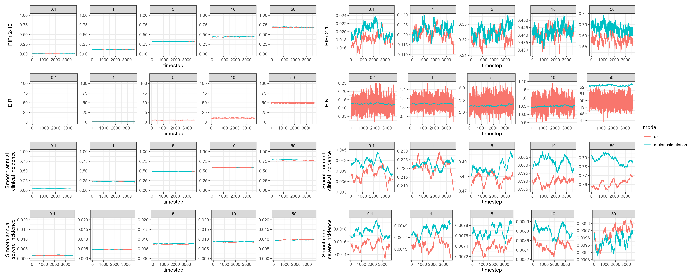
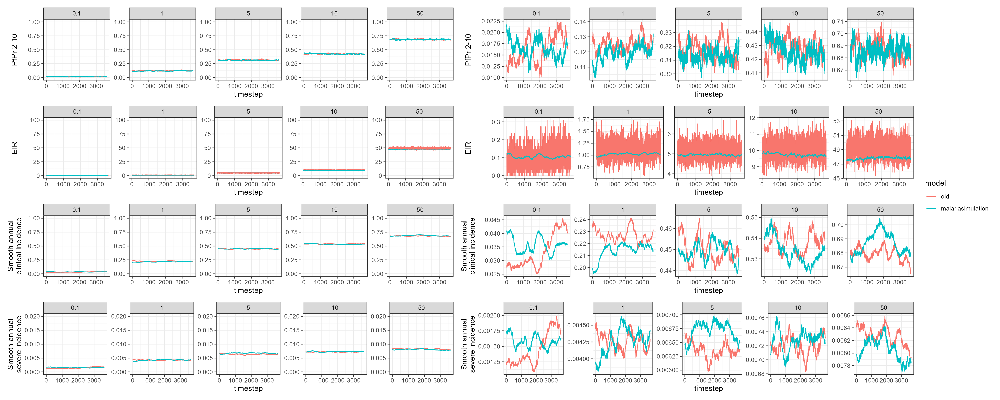
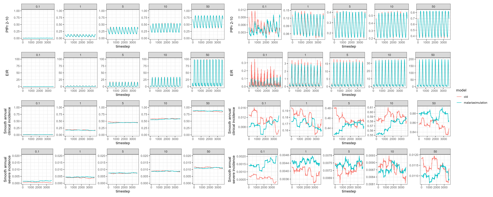
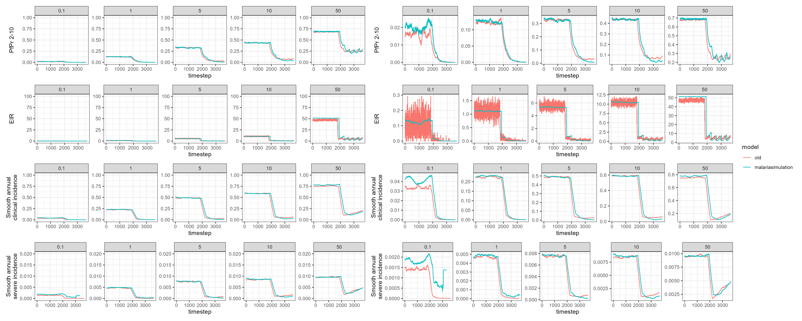

<!-- README.md is generated from README.Rmd. Please edit that file -->

```{r, include = FALSE}
knitr::opts_chunk$set(
  collapse = TRUE,
  comment = "#>"
)
```

### No Seasonality, no interventions, exponential demography


### No Seasonality, no interventions, custom demography


### Seasonality, no interventions, exponential demography


### No Seasonality, treatment, exponential demography


### No Seasonality, nets, exponential demography


### No Seasonality, RTS,S , exponential demography
